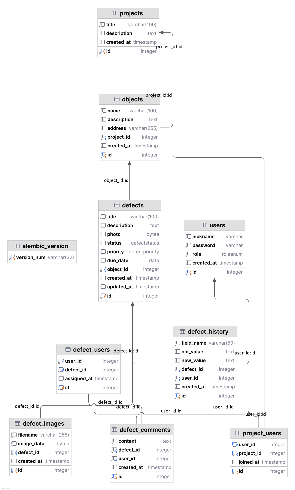

# Construction Control
Монолитное веб-приложение для централизованного управления дефектами на строительных объектах. Система обеспечивает полный цикл работы: от регистрации дефекта и назначения исполнителя до контроля статусов и формирования отчётности для руководства.
## Бизнес цели
К главным целям разработки можно отнести:
1. Ускорение и упрощение фиксации дефектов на объектах стройки для улучшения качества работ и уменьшения затрат времени на бюрократию.
2. Улучшение отчётности по дефектам.
3. Более наглядная статистика и статусы задач.
4. Ускорение проведения работ благодаря назначению задач рабочим на един информационном ресурсе.
## Функциональные требования
Функциональные требования описывают конкретные возможности системы, которые необходимо реализовать. Это позволяет сегментировать разработку на отдельные подзадачи и упрощает понимание главных функции и частей системы.\
К функциональным требованиям можно отнести:
1. Регистрация пользователей и аутентификация.
2. Разграничение прав доступа (менеджер, инженер, наблюдатель). 
3. Управление проектами/объектами и их этапами. 
4. Создание и редактирование дефектов (заголовок, описание, приоритет, исполнитель, сроки, вложения). 
5. Управление статусами дефектов: Новая → В работе → На проверке → Закрыта/Отменена. 
6. Ведение комментариев и истории изменений. 
7. Поиск, сортировка и фильтрация дефектов. 
8. Экспорт отчётности в CSV/Excel. 
9. Просмотр аналитических отчётов (графики, статистика).
## Нефункциональные требования
Нефункциональные требования определяют, как система должна работать и какие качества она должна демонстрировать.
К нефункциональным требованиям можно отнести:
1. Время отклика страницы ≤ 1 секунды (для 50 активных пользователей). 
2. Обеспечить резервное копирование БД раз в сутки. 
3. Интерфейс на русском языке, адаптивный под ПК/планшеты. 
4. Совместимость с Chrome/Firefox/Edge последних версий. 
5. Пароли хранить с использованием bcrypt или ar gon2. 
6. Защита от SQL-инъекций, XSS и CSRF.
## ERD диаграмма
Диаграмма базы данных:
